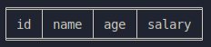

# CLI-DB

## Project setup
### Windows
```
pip install tabulate
```
Execute cli-db/main.py
```
python main.py
```
Execute cli-db/cli/main.py
```
python main.py
```

### Linux
```
sudo apt install python3-tabulate
```
Execute cli-db/main.py
```
python3 main.py
```
Execute cli-db/cli/main.py
```
python3 main.py
```

## Example Usage
### Creating database
```
cli-db> CREATE DATABASE BANK
Database created Successfully
```

### Show databases
```
cli-db> SHOW DATABASES
bank
```

### Use database
```
cli-db> USE BANK
```

### Creating table
> [!WARNING]
> Ensure no spacing between column names
```
cli-db> CREATE EMPLOYEE (ID,NAME,AGE,SALARY)
Table created successfully
```


### Inserting data
> [!WARNING]
> Ensure no spacing between column names
```
cli-db> INSERT (1,Rohan,25,230000) EMPLOYEE
Data inserted successfully
cli-db> INSERT (2,Rajat,22,110000) EMPLOYEE
Data inserted successfully
cli-db> INSERT (3,Tarun,20,70000) EMPLOYEE
Data inserted successfully
```

### View table format
```
cli-db> VIEW DESC EMPLOYEE

```